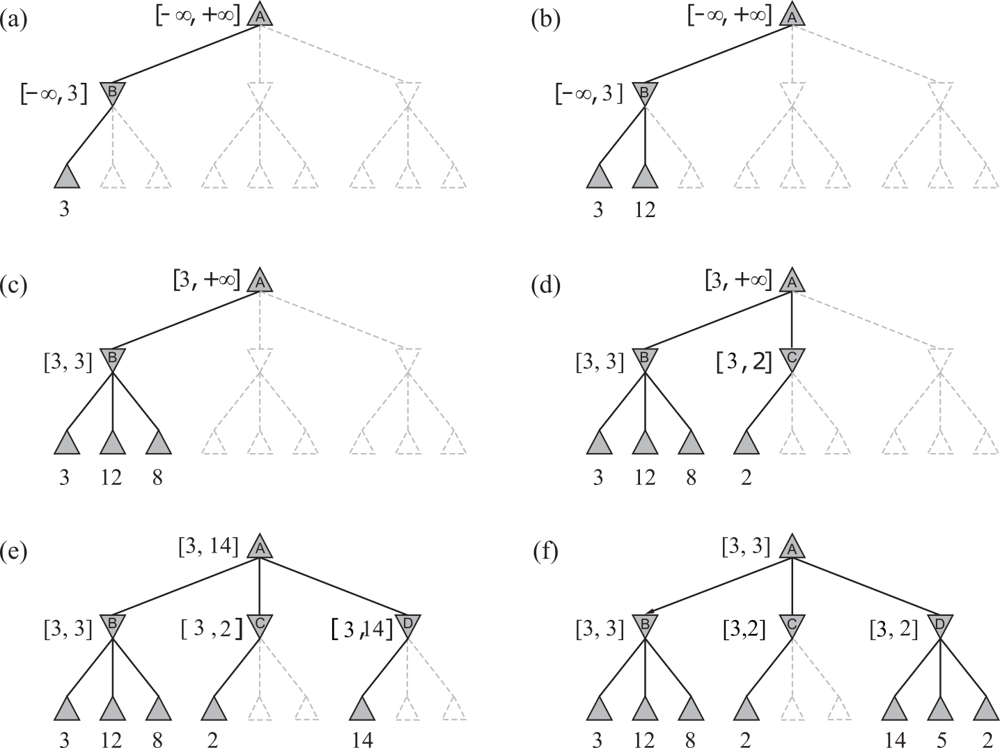
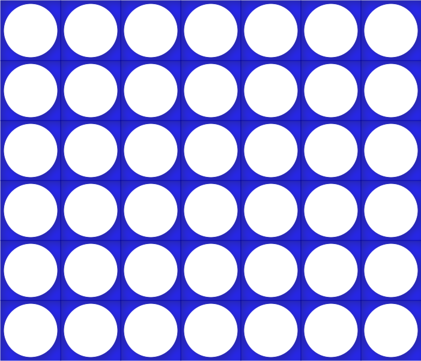

# Seminar Minimax

Source code and documentation for a seminar about Minimax algorithm. The documentation explains the Minimax algorithm, using the game Tic-Tac-Toe as an example. Alpha-Beta pruning is introduced as an optimization of the main algorithm, that still finds the optimal solution. The described algorithms are implemented in the game "4 in a row". Because of a large number of possible game states, a heuristic approximation is used to improve calculation speed.

## Minimax
Minimax algorithm is used to determine the best possible move in a zero-sum game. In order to do so, it tries every possible move for the current player and calculates the expected result for that move. After that, it simply chooses the move with the highest score. Because of that, this step is called the max step.
To calculate the expected score for a given move, the algorithm checks every possible opponent move, with the assumption that the opponent plays optimally. After that, it chooses the move with the least score (meaning that it is the highest score for the opponent). This step is called the min step. 
Those two steps are repeated until a final game state is reached which can be seen in the image below.

## Alpha-Beta pruning
In order to calculate the optimal move, it is not always necessary to check every possible move. To do so, the current interval for the solution is being calculated. If the current move (on any depth) is better than the current interval in min state, the solution doesn't need to be calculated because min will never choose that move. The same is valid for a move in the max step that is worse than the current interval. This can be seen in the image below.

## 4 in a row
The game "4 in a row" is a two player game played on a 6x7 board, as shown in the image below. Each player drops a coin during his turn in one of the 7 rows. The first player to reach 4 connected coins wins. The game is implemented in Java, using the described algorithms for AI. In order to speed up the calculation, a heuristic approach is used.

More detail about everything mentioned above can be found in the documentation.
